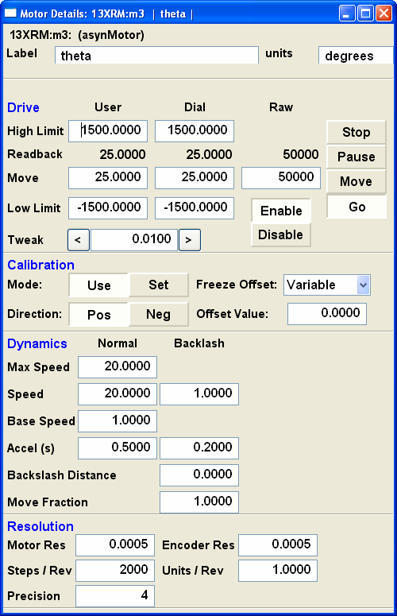
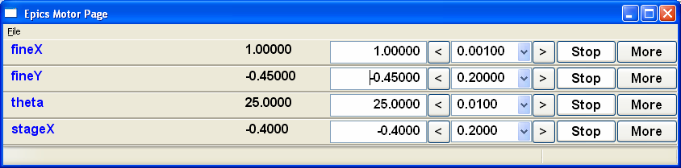

============================================
:mod:`epics.wx`   wxPython Widgets for epics
============================================

Overview
========

.. module:: wx
   :synopsis: wxPython objects for epics

This module provides a set of wxPython classes for epics PVs. Most of these are
derived from wxPython widgets, with special support added for epics PVs,
especially regarding when to automatically update the widget based on a
changing value for a PV.

Examples of some wx code is included in the *scripts* folder of the pyepics
source distribution kit.

..  _wx-functions-label:

wx Widgets for Epics
=================================

pvCtrlMixin
~~~~~~~~~~~~

.. class:: pvCtrlMixin(parent, pv=None, font=None, fg=None, bg=None, **kw)

   This is a mixin class for wx Controls with epics PVs:  This connects to
   PV, and manages callback events for the PV. 

  :param parent: wx parent widget
  :param pv:     epics.PV
  :param font: wx.Font for display
  :param fg:   foreground colour
  :param bg:   background colour

   A class that inherits from this class **must** provide a method called
   `_SetValue`, which will set the contents of the corresponding widget
   when the PV's value changes.

   In general, the widgets will automatically update when the PV
   changes. Where appropriate, setting the value with the widget will set
   the PV value.

pvText       
~~~~~~~~

.. class:: pvText(parent, pv=None, font=None, fg=None, bg=None,
                  minor_alarm="DARKRED", major_alarm="RED",
                  invalid_alarm="ORANGERED", **kw)

  derived from wx.StaticText and pvCtrlMixin, this is a StaticText widget
  whose value is set to the string representation of the value for the
  corresponding PV.

  By default, the text colour will be overriden when the PV enters an
  alarm state. These colours can be modified (or disabled by being set
  to None) as part of the constructor.

pvTextCtrl   
~~~~~~~~~~~

.. class:: pvTextCtrl(parent, pv=None, font=None, fg=None, bg=None, **kw)

    derived from wx.TextCtrl and pvCtrlMixin, this is a TextCtrl widget
    whose value is set to the string representation of the value for the
    corresponding PV.  Setting the value (hitting Return or Enter) of the
    widget will set the PV value.

pvFloatCtrl  
~~~~~~~~~~~

.. class:: pvFloatCtrl(parent, pv=None, font=None, fg=None, bg=None, **kw)

    A special variation of a wx.TextCtrl that allows only floating point
    numbers, as associated with a double, float, or integer PV.  Trying to
    type in a non-numerical value will be ignored.  Furthermore, if a PV's
    limits can be determined, they will be used to limit the allowed range
    of input values.  For a value that is within limits, the value will be
    `put` to the PV on return.  Out-of-limit values will be highlighted in
    a different color.

pvFloatSpin
~~~~~~~~~~~

.. class:: pvFloatSpin(parent, pv=None, deadTime=500, min_val=None, 
                       max_val=None, increment=1.0, digits=-1, **kw)

    A FloatSpin is a floatin point spinctrl with buttons to increase
	 and decrease the value by a particular increment. Arrow keys and
	 page up/down can also be used (the latter changes the value by 10x
	 the increment.)

	 pvFloatSpin is a special derivation that assigns a PV to the FloatSpin
	 control. deadTime is the delay (in milliseconds) between when the user
	 finishes typing a value and when the PV is set to it (to prevent
	 half-typed numeric values being set.)

pvButton
~~~~~~~~~~~

.. class:: pvButton(parent, pv=None, pushValue=1, disablePV=None, 
                    disableValue=1, **kw)

    A wx.Button linked to a PV. When the button is pressed, 'pushValue'
	 is written to the PV (useful for momentary PVs with HIGH= set.)

	 Setting disablePV and disableValue will automatically cause the
	 button to disable when that PV has a certain value.

pvRadioButton
~~~~~~~~~~~

.. class:: pvRadioButton(parent, pv=None, pvValue=None, **kw)

    A pvRadioButton is a radio button associated with a particular PV 
	 and one particular value.
       
    Suggested for use in a group where all radio buttons are
    pvRadioButtons, and they all have a discrete value set.

pvComboBox
~~~~~~~~~~~

.. class:: pvComboBox(parent, pv=None, **kw)

    A ComboBox linked to a PV. Both reads/writes the combo value on changes.

pvEnumButtons
~~~~~~~~~~~~~~~~~~

.. class:: pvEnumButtons(parent, pv=None, font=None, fg=None, bg=None, **kw)

   This will create a wx.Panel of buttons (a button bar), 1 for each
   enumeration state of an enum PV.  The set of buttons will correspond to
   the current state of the PV

pvEnumChoice 
~~~~~~~~~~~~~~~~~~

.. class:: pvEnumChoice(parent, pv=None, font=None, fg=None, bg=None, **kw)

   This will create a dropdown list (a wx.Choice) with a list of enumeration
   states for an enum PV.  

pvAlarm   
~~~~~~~~~~

.. class:: pvAlarm(parent, pv=None, font=None, fg=None, bg=None, trip_point=None, **kw)

    This will create a pop-up message (wx.MessageDialog) that is shown when
    the corresponding PV trips the alarm level.

Decorators and other Utility Functions
==========================================

.. function:: DelayedEpicsCallback

decorator to wrap an Epics callback in a wx.CallAfter,
so that the wx and epics ca threads do not clash
This also checks for dead wxPython objects (say, from a
closed window), and remove callbacks to them.

..  function::  EpicsFunction

decorator to wrap function in a wx.CallAfter() so that
Epics calls can be made in a separate thread, and asynchronously.

This decorator should be used for all code that mix calls to wx and epics    

..  function::  finalize_epics

This function will finalize epics by calling
:meth:`epics.ca.finalize_libca`.  It is recommended that this be added to
any "close GUI" code, such as a method bound to `wx.EVT_CLOSE(self,
self.onClose)`, where the function might look like this::

    def onClose(self, event):
        finalize_epics()
        self.Destroy()

wxMotorPanel Widget
========================

A dedicated wx Widget for Epics Motors is included in the :mod:`wx` module
that provides an easy-to-use Motor panel that is similar to the normal MEDM
window, but with a few niceties from the more sophisticated wx
toolkit. This widget can be used simply as::

    import wx
    from epics.wx import MotorPanel
    ....
    mymotor = MotorPanel(parent, 'XXX:m1')

A sample panel looks like this

.. image:: wx_motor.png

Which shows from right to left: the motor desription, an information
message (blank most of the time), the readback value, the drive value,
arrows to tweak the motor, and a drop-down combobox for tweak values, a
"Stop" button and a "More" button.  The panel has the following features:
	
   *  All controls are "live" and will respond to changes from other source.
   *  The values for the tweak values in the ComboBox are automatically
      generated from the precision and travel range of the motor. 
   *  The entry box for the drive value will *only* accept numeric input,
      and will only set the drive value when hitting Enter or Return.
   *  The drive value  will change to Red text on a Yellow background when
      the value in the box violates the motors (user) limits.  If Enter or
      Return when the the displayed value violates the limit, the motor
      will not be moved, but the displayed value will be changed to the
      closest limit value.
   *  Pressing the "Stop" button will stop the motor (with the `.SPMG`
      field), and set the Info field to "Stopped".  The button label will
      change to "Go", and the motor will not move until this button is pressed.

Finally, the "More" button will bring up a more complete form of Motor
parameters that looks like:

Many such MotorPanels can be put in a vertical stack, as generated from the
'wx_motor.py' script in the scripts folder of the source distribution as::

   ~>python wx_motor.py XXX:m1 XXX:m2 XXX:m3 XXX:m4

will look like this:

